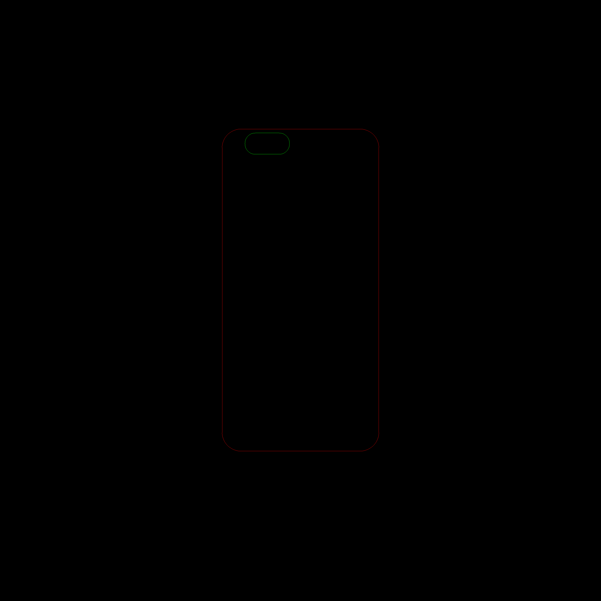

# 使用node-opencv检测手机壳数据

只能说。。人被逼急了，就会开动脑筋解决问题了

背景是这样的：
为了释放生产力，解决这里需要人手工测量的问题

比如：

这是一张带手机壳的图片，那么怎么测量出它的一些数值呢，比如占背景的宽度/圆角/高度/宽度/孔的位置呢

想起了好久没用的opencv，但是当年还写的是C++，后来发现居然有node-opencv 

这是官方地址：git@github.com:peterbraden/node-opencv.git

```bash
  // 环境安装
  brew tap homebrew/science
  brew install opencv@2
  brew link --force opencv@2
  
  //自己项目里
  npm install opencv
```
第一步读取图片：
```javascript
cv.readImage('./files/test.jpg', function(err, im) {
  if (err) throw err;
  let template = {}
  width = im.width()
  height = im.height()
  ....
```
第二步转变为灰度图像，canny算法进行边缘检测：
canny是个（古老）的算法，基本上也是图像处理的入门算法了，可惜我一个前端早就忘得差不多了
```javascript
  im.convertGrayscale()
  im_canny = im.copy();
  im_canny.canny(lowThresh, highThresh);
  im_canny.dilate(nIters);
```
第三部提取边缘数据：
```javascript
  //这里是个数组，投机的取了最大面积的轮廓和最小面积的，全当大轮廓和手机的孔
  contours = im_canny.findContours()
```
其实每个contour都有很多方法，可以通过代码罗列出来：
```javascript
  [Function: point]
  [Function: points]  // 所有的点
  [Function: size]
  [Function: cornerCount] // 角点检测
  [Function: area]
  [Function: arcLength] //周长
  [Function: approxPolyDP] //多边形拟合
  [Function: convexHull] //凸包
  [Function: boundingRect] //外接矩形
  [Function: minAreaRect] //最小包围矩形
  [Function: fitEllipse] //应该是用椭圆或者圆形拟合
  [Function: isConvex]
  [Function: moments] //中心矩
  [Function: hierarchy]//轮廓有一定的层次
  [Function: serialize]
  [Function: deserialize]
```
拿出每个轮廓的外接矩形，也就知道宽高了

这里因为要计算border-radius，我们要计算外接矩形和手机壳的切点数据，就用了所有的点值位置进行了对比；
border-radius的值其实就是一个边界的内切圆的宽比上整个手机壳宽度，或者用高度比也行，其实长宽比保持一样的，具体的大家可以去了解border-radius的原理；

做的比较粗糙。。以后再改进吧



